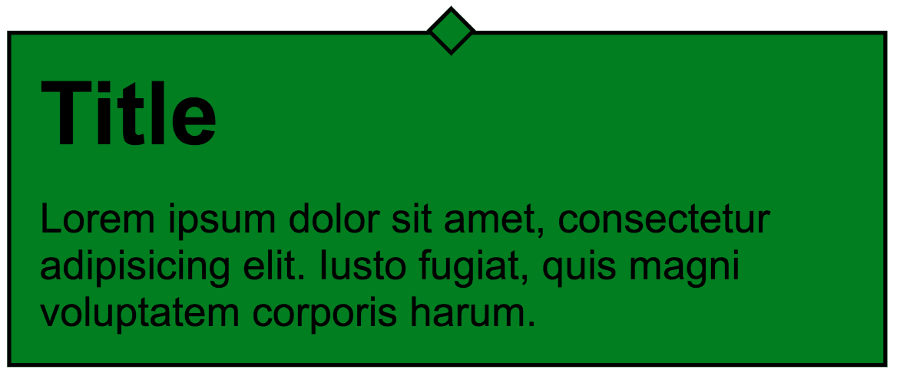

# Sass

> Remember to separate exercises with comments and to write legible, well formatted code.

## Exercise done with the lecturer

### Exercise 1. Simple mixin  (~ 5min - 10min)

In `index.html` find a `section` element with `test-mixin` class. Style the elements within according to their class descriptions (border, left side, etc.)
Next, create a simple mixin that will add `:before` and `:after` pseudo-elements to an appropriate element. Name it **clearfix**.

-------------------------------------------------------------------------------

## Exercises to do on your own

### Exercise 1. Mixin border  (~ 5min - 10min)
Create a mixin that will set font size for the `header` element based on the `$font` parameter passed to it. It should also set `border-radius` to `5px`.

### Exercise 2. Dialog  (~ 10min - 15min)

Create a mixin named `dialogBox` that will take two parameters - color ($backgroundColor) and box width ($width). Its task will be to set styles for the element with `dialog` class (in the `dialog.html` file).

```
  width: $width;
  padding: 10px;
  background: $backgroundColor;
  border: 1px solid black;
  margin: 40px auto;
```

In the mixin, add a `:after` pseudo-element that will create a 10x10px square that decorates the box. The final effect should be following:



Test your code for `green` and `lightgray` background, and also test it with random widths.
