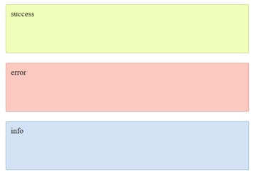

# Sass

> Remember to separate exercises with comments and to write legible, well formatted code.

## Exercise done with the lecturer

### 1. Clearfix once more (~ 5min - 10min)

In `index.html`find `section` element with `test-mixin` class. Style the elements within it according to their class descriptions (border, left side, etc.)
Next, using a sass placeholder - `%`, create a rule for clearfix. Clearfx should add `:before` and `:after` pseudo-classes to an appropriate element.
Use the `@extend` directive to extend individual elements with that placeholder.

-------------------------------------------------------------------------------

## Exercises to do on your own

### Exercise 1. Inheriting  (~ 5min - 10min)
In the presentation we discussed problems associated with extend. We specified the following problems:
* with unintended styles - each ```error``` **class** was underlined and changed color on hover,
* with unintended and redundant selectors.
Try to fix both problems that occur in the code below.
For the sake of simplicity, you can add HTML code in this exercise.
```CSS
#admin .nav a {
  color: #333;
}
a{
  color: #666;
}
#demo .body .link {
  @extend a;
}
```

### Exercise 2. Placeholder (~ 10min - 15min)

In `index.html` find `section` element with `container` class.
Within it, create three boxes representing: success, error and info.



Style them using Sass. Try to use a **placeholder** in this exercise so as not to generate additional CSS rule. Your HTML code should look like this:

```JavaScript
<div class="success">success</div>

<div class="error">error</div>

<div class="info">info</div>
```
