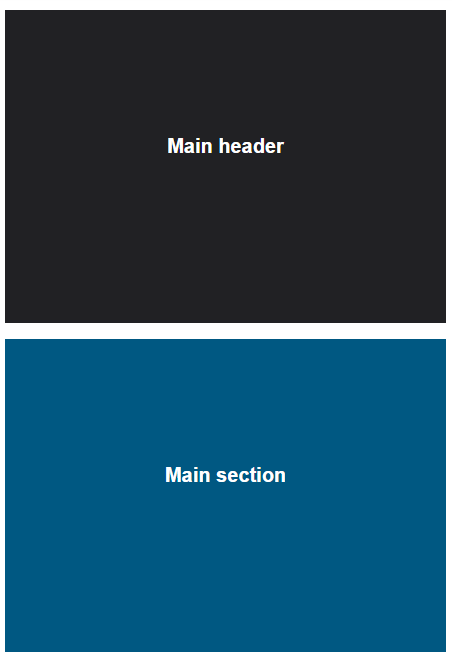

# RWD &ndash; Mobile first

> Remember to separate exercises with comments and to write legible, well formatted code.

## Exercise done with the lecturer

### Change of background  (~ 5min - 10min)

In `index.html` change background color to yellow if the width of the screen is less than `420px`. Use the mobile first approach.

-------------------------------------------------------------------------------

## Exercises to do on your own

### Exercise 1. Mixin, mobile first  (~ 15min - 20min)

In `index.html` you will find a section with `container` class that has a `div` element with `sidebar` class and a `section` element in it. Use the mobile first approach.
Place the elements in the following order:

For screens below 600px wide:

For screens over 600px wide:

