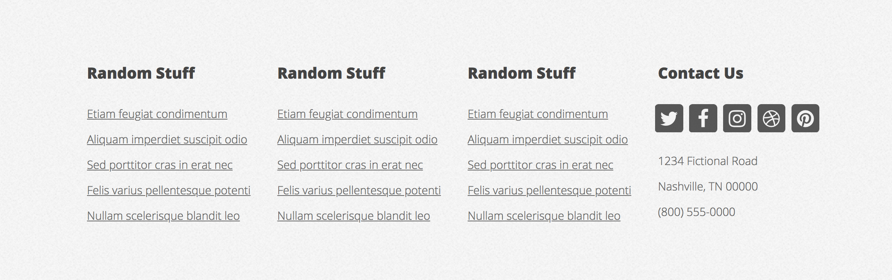
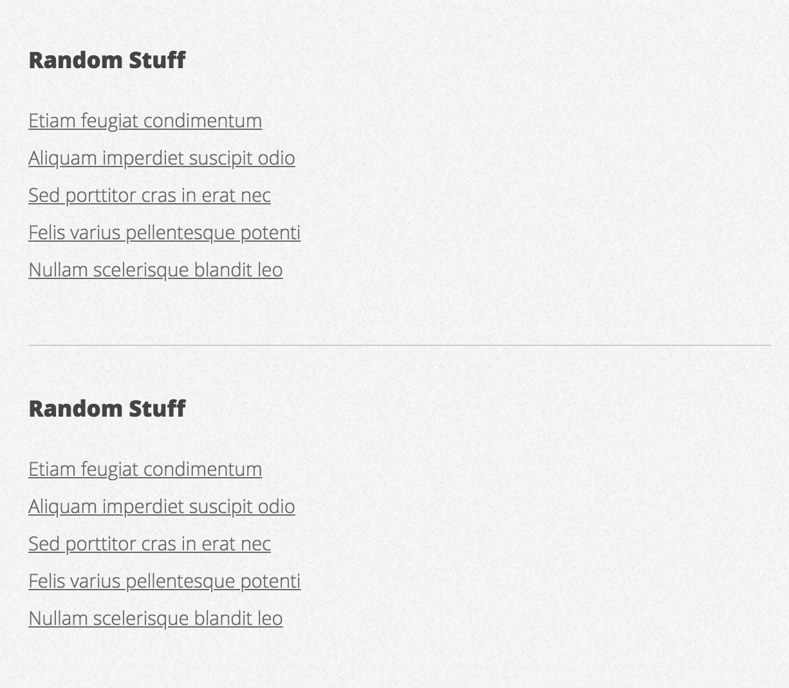

# RWD &ndash; Flexbox

> Remember to separate exercises with comments and to write legible, well formatted code.

## Exercise done with the lecturer

We are about to create a webpage. The fully functional webpage can be seen here: https://html5up.net/verti

### Project setup (~10min - 15min)

Create a fully functional project with:

* directory structure
* appropriate SASS files
* GULP configuration

### First section (~25min - 30min)

Using flexbox and the knowledge about RWD, create the following section.

Desktop:

Tablet:

Mobile:

Hints:

* Font used in the project - Open-Sans (https://fonts.google.com/specimen/Open+Sans)
* Icons come from font-awesome (you can use cdn:  https://cdnjs.com/libraries/font-awesome )
* Arrow icon class - `fa-arrow-circle-right`
* Question mark icon class - `fa-question-circle`
* Page background - #E4E4E4
* Font color - #444444
* Log background - #FC4887 (this is the text in a rectangle)
* Blue button border - #1691C3
* Never mind the navigation - there is an exercise about it in the next section :)

-------------------------------------------------------------------------------

## Exercises to do on your own

### Second section (~10min - 15min)

Using flexbox and the knowledge about RWD, create the following section:

Desktop:

Tablet:

Hints:

* Images are in the assets directory
* The elements should fall under each other if they are less than 300px wide

### Third section (~25min - 30min)

Using flexbox and the knowledge about RWD, create the following section:

Desktop:

Tablet:

Hints:

* Images are in the assets directory
* Document icon class - `fa-file-text-o`

### Fourth section (~15min - 20min)

Using flexbox and the knowledge about RWD, create the following section:

Desktop:

Tablet:

Mobile:

Hints:

* Twitter icon class - `fa-twitter`
* Facebook icon class - `fa-facebook`
* Instagram icon class - `fa-instagram`
* Dribble icon class - `fa-dribbble`
* Pinterest icon class - `fa-pinterest`
