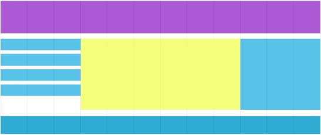
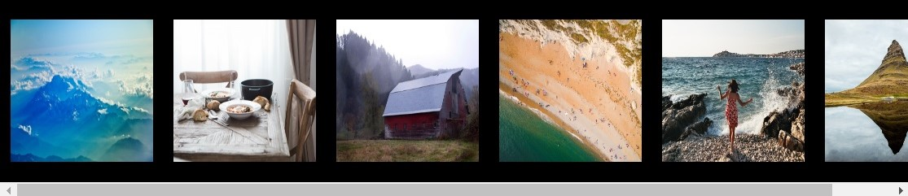
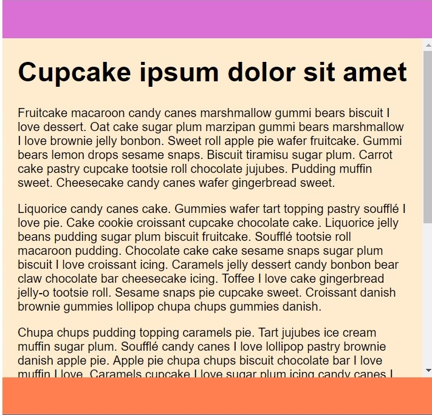

# Sass & RWD - homework

> Write the code in appropriate files according to exercise descriptions.

**VERY IMPORTANT - Your homework is checked using an automated system. In order for the answers to be considered correct, all the pages MUST display the same messages as in the exercise description, and function and method names MUST be the same as in the exercise description!**

### Day 3 - RWD part 2
> Do the exercises in main.scss and index.html. Generate an appropriate .css file in the css directory.
Add a .gitignore file (include node_modules in it).

#### Exercise 1. Flexbox &ndash; layout
In `index.html` you will find a section named `hoily-grail`.
Using flexbox, create a page template based on the layout you see below:

#### Exercise 2. Flexbox. flex-shrink property
> Should be performed in a browser other than Chrome

In `index.html` you will find a section named `flex-container`.

* Add display: flex property to its class and set a background. Make the flex direction horizontal.
* Next, inside the container, add several photos side by side so that their combined width is no less than 500px but not greater than 1024px – the sizes of the photos should be the same.
* Align the photos so that they are centered in relation to the height of the container.
* Add appropriate properties to the container and to the photos in a way that photos do not shink when the browser window is shinked, but scroll.
* The use of `overflow` property will be necessary.

#### Exercise 3. Flexbox. flex-grow and flex-shrink properties
> Turn on the responsive display mode in your browser and set the window to mobile width

In `index.html` you will find a section named `flex-container-column`.

* Add display: flex property with vertical orientation to its class and set the height to 100vh.
* Add three section to the container: header, main and footer. Each of them should have a colorful background.
* Set any height you choose for the header and footer.
* Add several paragraphs to the main section.
* Using the property of flex-box set the header and footer in a way that they are always visible in the browser window – they should stick to the top and bottom of the window appropriately.
* Add appropriate properties so that the text in the middle section was scrolled when browser window height is decreased.
* The use of `overflow` property will be necessary.

